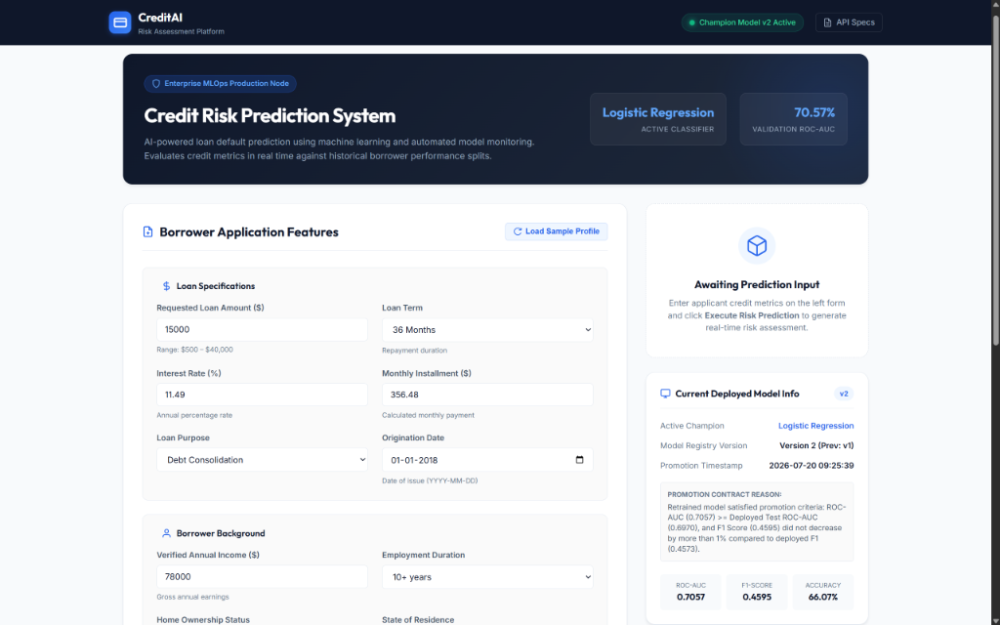
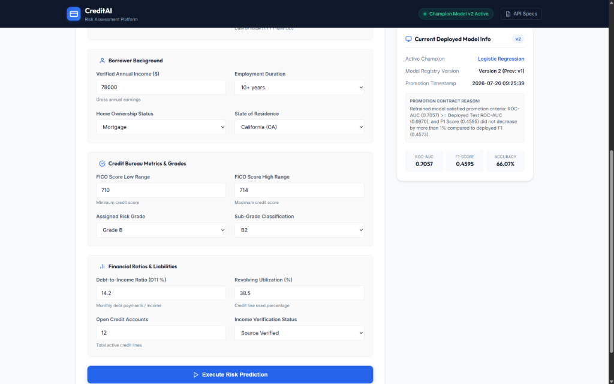
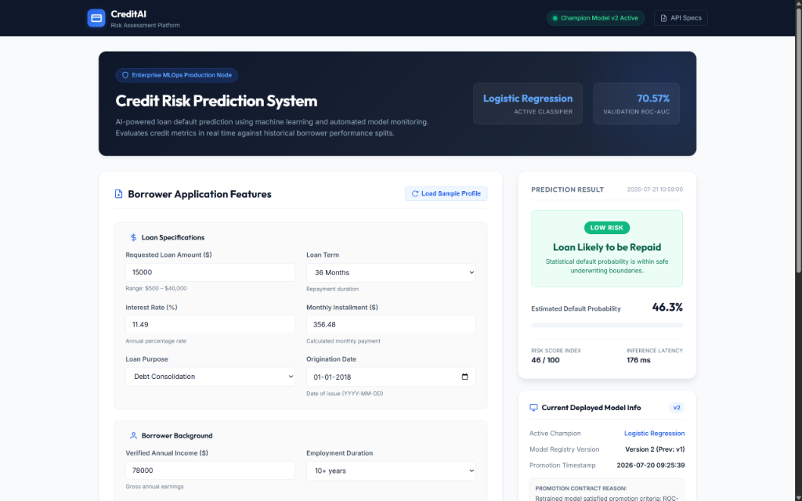
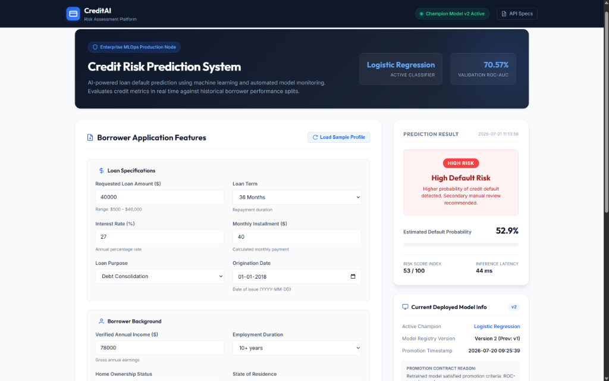
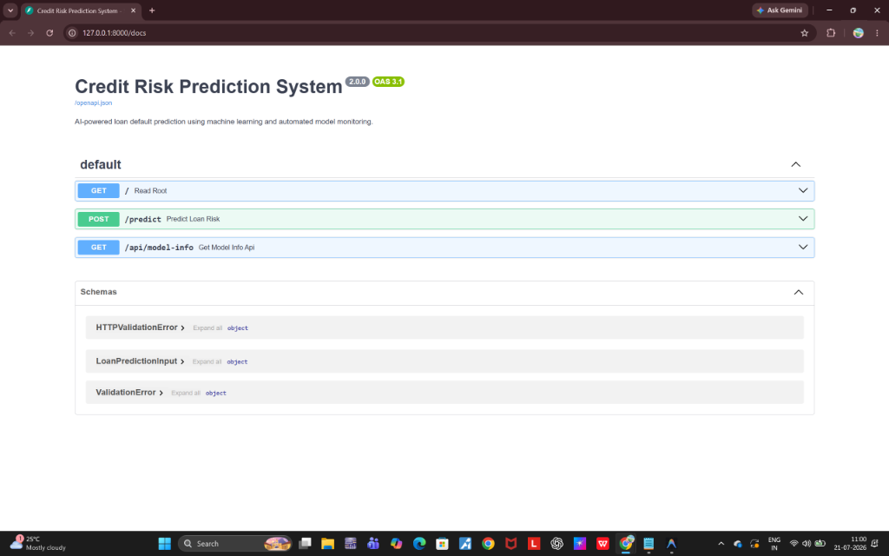
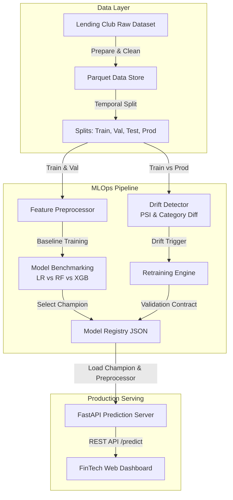
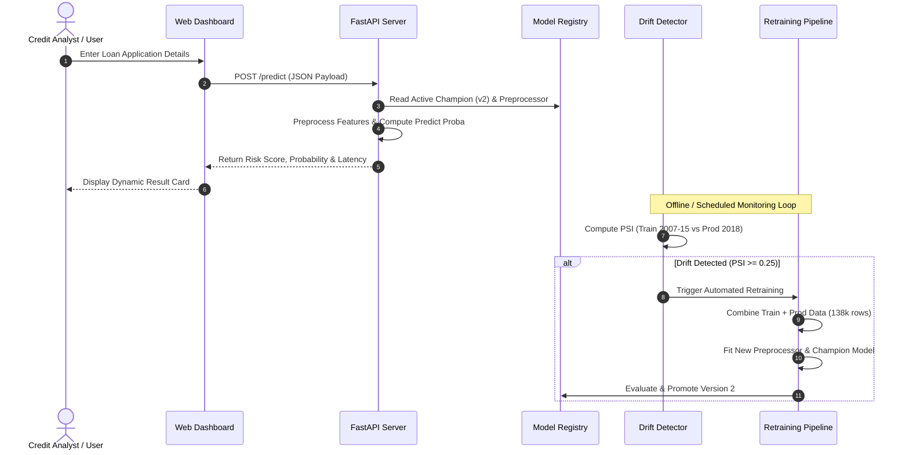

# CreditAI – Intelligent Credit Risk Assessment Platform

[](https://www.python.org/)
[](https://fastapi.tiangolo.com/)
[](https://scikit-learn.org/)
[](https://xgboost.readthedocs.io/)
[](LICENSE)

An enterprise-grade, end-to-end MLOps platform for loan default prediction and credit risk assessment. Built with Python, Scikit-Learn, XGBoost, and FastAPI, **CreditAI** automates the complete machine learning lifecycle—from chronological data splitting and feature engineering to model registry management, Population Stability Index (PSI) data drift monitoring, automated retraining, and a real-time SaaS prediction dashboard.

---

## 📌 Executive Summary & Screenshot Gallery

CreditAI bridges the gap between machine learning model development and production MLOps governance. It serves real-time credit default probabilities while continuously monitoring feature distribution shifts across temporal populations.

<div align="center">

### Real-Time Credit Risk Assessment Dashboard

*Figure 1: The CreditAI FinTech SaaS dashboard displaying organized borrower feature input cards, real-time risk assessment indicators, and live MLOps Model Registry metadata (Version 2).*

</div>

<br>

<details>
<summary>📸 <strong>View Full Interface Gallery (Low Risk, High Risk, Form Inputs & API Specs)</strong></summary>

<br>

<div align="center">

### Borrower Application Input & Model Info Card

*Figure 2: Organized 2-column borrower input fields alongside the production Model Registry card displaying active model version, promotion contract reasons, and validated metrics.*

### Low Risk Evaluation Result

*Figure 3: Real-time low-risk prediction output ("Loan Likely to be Repaid"), default probability (46.3%), risk score index (46/100), and inference latency (176 ms).*

### High Risk Default Warning

*Figure 4: Dynamic high-risk prediction warning ("High Default Risk"), elevated default probability (52.9%), and automatic underwriting review recommendation.*

### OpenAPI / Swagger Documentation (`/docs`)

*Figure 5: Automatic interactive OpenAPI documentation powered by FastAPI, detailing REST endpoints, Pydantic schemas, and request payloads.*

</div>

</details>

---

## 🌟 Key Platform Features

- **Chronological Temporal Data Splitting**: Strict time-based data splitting (Train: 2007–2015, Validation: 2016, Test: 2017, Production Simulation: 2018) prevents temporal data leakage.
- **Production Preprocessing Pipeline**: Automated numeric imputation & standard scaling combined with categorical imputation & one-hot encoding outputting dense DataFrames.
- **Fair Multi-Model Benchmarking**: Automated comparison across Logistic Regression, Random Forest, and XGBoost using class-weight balancing and scale-pos-weight optimization.
- **Automated Model Registry & Versioning**: Version-controlled model deployment metadata tracking promotion reasons, timestamps, and validation metrics.
- **Population Stability Index (PSI) Drift Detection**: Quantile-binned PSI computation for numerical features and category frequency divergence monitoring for categorical features.
- **Closed-Loop Automated Retraining**: Conditional retraining pipeline triggered by data drift that fits a fresh preprocessor, retrains on combined data, and promotes the champion model upon meeting performance contracts.
- **High-Performance FastAPI Inference**: Async prediction server serving probability estimations and risk scores with sub-50ms inference latency.
- **Modern FinTech Dashboard**: Responsive SaaS UI built with HTML5, CSS3, Jinja2, and Vanilla JavaScript with glassmorphic cards and live MLOps statistics.

---

## 🛠️ Tech Stack

- **Core Programming**: Python 3.12
- **Machine Learning & Pipeline**: Scikit-Learn, XGBoost, Joblib, PyArrow
- **Data Engineering & Analytics**: Pandas, NumPy
- **Web API & Server**: FastAPI, Starlette, Uvicorn, Jinja2, Pydantic V2
- **Frontend & Styling**: Vanilla HTML5, CSS3 (Custom Dark Navy FinTech Design System), JavaScript (Fetch API)
- **Dataset Source**: Lending Club Accepted Loans Dataset (2.26M+ historical credit records)

---

## 📐 Platform Architecture & Workflow

### High-Level System Architecture



### Complete End-to-End MLOps Workflow



---

## 🔬 Pipeline Phase Breakdown

<details>
<summary>🔍 <strong>Phase 1: Data Preprocessing & Cleaning</strong></summary>

<br>

- **Chunked Processing**: Processed 2.26M+ raw rows in memory-efficient chunks of 25,000 using `float32` type-casting and categorical pre-casting (`psutil` RAM profiling kept peak memory under 270 MB).
- **Target Encoding**: Mapped `loan_status` classes to binary target `0` (Fully Paid) and `1` (Charged Off / Default).
- **Yearly Stratified Sampling**: Capped historical years at 20,000 rows per year using stratified sampling to maintain class balance, outputting `data/processed/loan_default_processed.parquet`.
</details>

<details>
<summary>🔍 <strong>Phase 2: Chronological Temporal Data Splitting</strong></summary>

<br>

To eliminate data leakage, data is partitioned strictly by issue date:
- **Training Set (2007–2015)**: 118,065 rows
- **Validation Set (2016)**: 20,000 rows
- **Held-Out Test Set (2017)**: 20,000 rows
- **Production Simulation Set (2018)**: 20,000 rows
</details>

<details>
<summary>🔍 <strong>Phase 3: Feature Preprocessing Pipeline</strong></summary>

<br>

- **Numerical Features (9)**: `loan_amnt`, `int_rate`, `installment`, `annual_inc`, `dti`, `fico_range_low`, `fico_range_high`, `open_acc`, `revol_util`. Transformed via `SimpleImputer(strategy="median")` + `StandardScaler()`.
- **Categorical Features (9)**: `term`, `grade`, `sub_grade`, `emp_length`, `home_ownership`, `verification_status`, `issue_d`, `purpose`, `addr_state`. Transformed via `SimpleImputer(strategy="most_frequent")` + `OneHotEncoder(handle_unknown="ignore")`.
- Saved baseline preprocessor to `artifacts/preprocessor.joblib`.
</details>

<details>
<summary>🔍 <strong>Phase 4 & 5: Model Training, Comparison & Selection</strong></summary>

<br>

- **Logistic Regression**: Configured with `class_weight="balanced"`, `max_iter=1000`. Fast training time (3.73s), high Recall (67.21%), strong ROC-AUC (0.7038).
- **Random Forest**: Configured with `n_estimators=300`, `class_weight="balanced"`. High Accuracy (76.51%) but poor Recall on minority default class (22.93%).
- **XGBoost**: Configured with `scale_pos_weight=5.056`, `learning_rate=0.05`, `n_estimators=300`. Highest validation ROC-AUC (0.7059).
- **Selection Decision**: Logistic Regression was selected as champion due to statistically equivalent ROC-AUC (within 0.005 of XGBoost) combined with superior minority class Recall (67.21% vs 62.83%) and lower computational complexity.
</details>

<details>
<summary>🔍 <strong>Phase 6: Held-Out Test Evaluation</strong></summary>

<br>

- Evaluated the selected Logistic Regression champion on the untouched 2017 test dataset:
  - **Test ROC-AUC**: `0.6970` (Minor decay of only 0.0068 vs 2016 validation)
  - **Test F1 Score**: `0.4573`
  - **Test Recall**: `71.30%` (Successfully captured 3,299 out of 4,627 bad loans)
</details>

<details>
<summary>🔍 <strong>Phase 7: Data Drift Monitoring via PSI</strong></summary>

<br>

- Monitored feature space divergence between historical training (2007–2015) and production (2018):
  - **Numerical Features**: Evaluated using Population Stability Index (PSI) across 10 quantile bins with zero-frequency epsilon handling.
  - **Categorical Features**: Evaluated using total frequency discrepancy $\sum |f_{\text{train}} - f_{\text{prod}}|$.
- **Drift Findings**: 3 features showed Significant Drift ($\ge 0.25$: `issue_d` 2.00, `revol_util` 0.3217, `verification_status` 0.2523) and 7 features showed Moderate Drift.
- Triggered overall decision: **`Retraining Recommended`**.
</details>

<details>
<summary>🔍 <strong>Phase 8: Automated Retraining & Model Promotion</strong></summary>

<br>

- Combined historical training (118,065 rows) + production data (20,000 rows) into a 138,065-row training dataset while keeping the 2017 test set untouched.
- Fitted a brand-new preprocessor (`artifacts/preprocessor_latest.joblib`) and retrained the champion model.
- **Promotion Contract**: Retrained ROC-AUC (`0.7057`) $\ge$ Deployed Test ROC-AUC (`0.6970`) and F1 Score (`0.4595`) did not drop.
- Updated `artifacts/model_registry.json` to **Version 2** (`logistic_regression_latest.joblib`).
</details>

---

## 📊 Model Comparison & Benchmarking

The table below summarizes validation metrics evaluated on the 2016 split during Phase 5 model selection:

| Rank | Model Architecture | Accuracy | Precision | Recall | F1 Score | Validation ROC-AUC | Training Time | Selection Status |
| :---: | :--- | :---: | :---: | :---: | :---: | :---: | :---: | :---: |
| 🥇 | **Logistic Regression (Baseline)** | **63.67%** | **35.29%** | **67.21%** | **0.4628** | **0.7038** | **3.73s** | **Promoted Champion (v1)** |
| 🥈 | **XGBoost Classifier** | 65.97% | 36.57% | 62.83% | 0.4623 | 0.7059 | 7.18s | Runner-Up |
| 🥉 | **Random Forest Classifier** | 76.51% | 49.06% | 22.93% | 0.3126 | 0.6973 | 12.46s | Benchmark Only |
| 🔄 | **Retrained Logistic Regression (v2)** | **66.08%** | **36.52%** | **61.93%** | **0.4595** | **0.7057** | **3.64s** | **Active Production Model (v2)** |

---

## 📁 Project Directory Structure

```text
loan-default-mlops/
├── app/                                 # FastAPI Serving & Web Dashboard
│   ├── main.py                          # FastAPI server endpoints & lifespan setup
│   ├── predictor.py                     # Singleton inference service & registry loader
│   ├── templates/
│   │   └── index.html                   # FinTech UI HTML5 dashboard template
│   └── static/
│       ├── style.css                    # Dark Navy FinTech CSS design system
│       └── script.js                    # AJAX Fetch API & dynamic result renderer
├── src/                                 # Core ML & MLOps Pipeline Scripts
│   ├── prepare_data.py                  # Chunked Kaggle download & stratified sampling
│   ├── split_data.py                    # Chronological temporal splitting
│   ├── preprocess.py                    # Feature transformer pipeline builder
│   ├── train_logistic_regression.py     # Logistic Regression trainer
│   ├── train_random_forest.py           # Random Forest trainer
│   ├── train_xgboost.py                 # XGBoost trainer
│   ├── select_best_model.py             # Benchmarking & registry initializer
│   ├── test_model.py                    # Held-out 2017 test evaluator
│   ├── drift_detection.py               # PSI & categorical drift monitor
│   ├── retrain_model.py                 # Automated retraining & registry promoter
│   └── archive/                         # Archived constrained experiment scripts
├── artifacts/                           # Versioned Metadata & Results (Git Managed)
│   ├── drift/
│   │   ├── drift_report.csv             # Sorted per-feature drift metrics
│   │   └── drift_summary.json           # Drift decision summary JSON
│   ├── results/                         # Model evaluation JSONs & predictions
│   ├── model_registry.json              # Active production champion metadata
│   └── feature_names.json               # One-hot encoded feature registry
├── assets/screenshots/                  # Repository UI documentation images
├── .gitignore                           # Configured to ignore data & heavy joblibs (>1GB)
├── README.md                            # Comprehensive project documentation
└── requirements.txt                     # Project dependencies
```

---

## 🚀 Local Setup & Installation

Follow these steps to set up and run CreditAI on Windows, macOS, or Linux.

### Prerequisites

- **Python**: Version `3.10` or higher (Python 3.12 recommended)
- **Git**: Installed on system

### Step 1: Clone Repository

```bash
git clone https://github.com/hemasri0106-cell/loan-default-mlops.git
cd loan-default-mlops
```

### Step 2: Create Virtual Environment

- **Windows (PowerShell)**:
  ```powershell
  python -m venv .venv
  \.venv\Scripts\Activate.ps1
  ```

- **macOS / Linux**:
  ```bash
  python3 -m venv .venv
  source .venv/bin/activate
  ```

### Step 3: Install Dependencies

```bash
pip install --upgrade pip
pip install fastapi uvicorn jinja2 python-multipart pandas numpy scikit-learn xgboost joblib pyarrow psutil
```

---

## 💻 Running the Web Application

To launch the FastAPI prediction server with live reload:

```bash
uvicorn app.main:app --reload
```

*Alternatively, execute directly via Python:*

```bash
python app/main.py
```

### Accessing Local Endpoints

- 🌐 **Web Dashboard UI**: [http://127.0.0.1:8000](http://127.0.0.1:8000)
- 📖 **Interactive OpenAPI Documentation (Swagger)**: [http://127.0.0.1:8000/docs](http://127.0.0.1:8000/docs)
- 🔍 **ReDoc Documentation**: [http://127.0.0.1:8000/redoc](http://127.0.0.1:8000/redoc)

---

## 🔌 API Endpoints Summary

### 1. Execute Risk Prediction
- **Endpoint**: `POST /predict`
- **Request Body**:
```json
{
  "annual_inc": 78000.0,
  "emp_length": "10+ years",
  "home_ownership": "MORTGAGE",
  "addr_state": "CA",
  "loan_amnt": 15000.0,
  "term": " 36 months",
  "int_rate": 11.49,
  "installment": 356.48,
  "purpose": "debt_consolidation",
  "issue_d": "2018-01-01",
  "fico_range_low": 710.0,
  "fico_range_high": 714.0,
  "open_acc": 12.0,
  "revol_util": 38.5,
  "dti": 14.2,
  "grade": "B",
  "sub_grade": "B2",
  "verification_status": "Source Verified"
}
```
- **Response**:
```json
{
  "prediction": "Loan Likely to be Repaid",
  "prediction_label": "Low Risk",
  "probability": 0.3969,
  "risk_score": 40,
  "latency_ms": 44.44,
  "timestamp": "2026-07-21 11:13:56"
}
```

### 2. Fetch Model Registry Metadata
- **Endpoint**: `GET /api/model-info`
- **Response**:
```json
{
  "selected_model": "Logistic Regression",
  "version": 2,
  "promotion_reason": "Retrained model satisfied promotion criteria: ROC-AUC (0.7057) >= Deployed Test ROC-AUC (0.6970)...",
  "promotion_date": "2026-07-20 09:25:39",
  "previous_version": 1,
  "metrics": {
    "accuracy": 0.66075,
    "precision": 0.3652,
    "recall": 0.6193,
    "f1_score": 0.4595,
    "roc_auc": 0.7057
  }
}
```

---

## 🔮 Future Enhancements

- [ ] **Docker Containerization**: Add `Dockerfile` and `docker-compose.yml` for multi-container deployment (FastAPI + Prometheus + Grafana).
- [ ] **Evidently AI Integration**: Enhance drift visualization with automated HTML monitoring dashboards.
- [ ] **CI/CD Pipeline**: Implement GitHub Actions workflow for automated testing, linting, and deployment.
- [ ] **MLflow Tracking**: Integrate MLflow tracking server for hyperparameter experiment logging.

---

## ✍️ Author & Contact

**Hemasri Challa**
- **Email**: [hemasri0106@gmail.com](mailto:hemasri0106@gmail.com)
- **GitHub**: [@hemasri0106-cell](https://github.com/hemasri0106-cell)
- **Repository**: [hemasri0106-cell/loan-default-mlops](https://github.com/hemasri0106-cell/loan-default-mlops)

---

## 📜 License

This project is licensed under the MIT License - see the [LICENSE](LICENSE) file for details.
